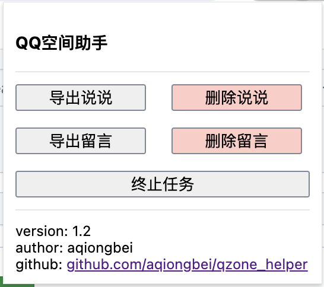

# 批量删除 QQ 空间说说 & 留言脚本

## Changelog

> 2024 年 08 月 02 日 16:05:42 第三版 修复 chrome 插件版本若干 bug
>
> 2020 年 05 月 24 日 17:04:45 第二版 chrome 插件版本([开发过程戳这里](https://segmentfault.com/a/1190000039297715))
>
> 2018 年 01 月 01 日 15:59:30 第一版 控制台脚本注入版本

## 原理简介

利用插件向页面注入批处理逻辑，通过模拟前端请求实现自动删除功能，过程中不需要用户参与交互，操作流畅迅速，**不会出现验证码**，同时方法安全可靠亦**不会造成封号风险**。但是频繁操作仍会触发后端限制逻辑,使用时候须留意.

## 声明

该脚本仅供学习、交流使用，任何个人、组织和单位不得用于牟利以及非法活动。

## 使用方法

就是一个 chrome 插件,操作一看就懂的.

#### Tips

无

### 问题

使用过程中有问题欢迎提[Issue](https://github.com/aqiongbei/qzone_helper/issues),遇到问题也请先翻 Issue。
