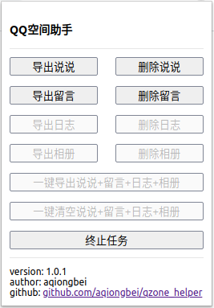

# 批量删除QQ空间说说 & 留言脚本
## Changelog
> 2020年05月24日17:04:45 第二版 chrome插件版本
> 
> 2018年01月01日15:59:30 第一版 控制台脚本注入版本

## 简介
当前的插件是直接掉空间的后台接口实现的，不需要与用户交互，操作流畅迅速，**不会出现验证码**，同时方法安全可靠**不会造成封号风险**。但是频繁操作会有提示,使用时候仍须留意.

## 声明
该脚本仅供学习、交流使用，任何个人、组织和单位不得用于牟利以及非法活动。

## 使用方法
就是一个chrome插件,操作一看就懂的.

#### Tips
无

### 问题
使用过程中有问题欢迎提[Issue](https://github.com/aqiongbei/qzone_helper/issues),遇到问题也请先翻Issue。
